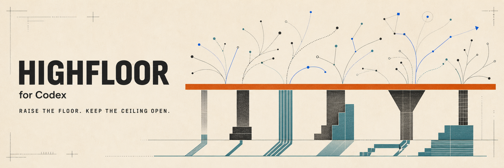

<p align="center">
  
</p>

<p align="center">
  <strong>A practical skill and specialist-agent kit for OpenAI Codex.</strong><br>
  Clearer paths for less capable models. More room for stronger ones.
</p>

<p align="center">
  <a href="README.md"><strong>English</strong></a> ·
  <a href="README_KR.md">Korean</a>
</p>

<p align="center">
  <a href="#install">Install</a> ·
  <a href="#philosophy">Philosophy</a> ·
  <a href="#skills">Skills</a> ·
  <a href="#custom-agents">Agents</a> ·
  <a href="#composable-workflows">Workflows</a>
</p>

> [!NOTE]
> Highfloor for Codex is an independent, unofficial community project. It is
> not affiliated with, endorsed by, or sponsored by OpenAI.

> [!WARNING]
> The complete bundle is **mixed-license and source-available, not OSI
> open-source as a whole**. Five adapted skills remain under Sustainable Use
> License 1.0. Read [License and upstream respect](#license-and-upstream-respect)
> before use or redistribution.

## What Highfloor is today

Today, Highfloor contains the skills and agents I use in my own Codex setup:

- **15 focused `cx-*` skills** for clarification, diagnosis, research, scope
  control, browser work, design direction, verification, video analysis, and
  unfamiliar-codebase mapping.
- **29 custom agent profiles** for focused investigation, review,
  implementation, documentation, and bounded fallback work.

It is a kit, not a standalone agent harness or an automatic pipeline. Each
skill and agent has a specific job, and you combine only the parts the current
task needs.

Adding another skill is not the default form of progress. When an existing
owner, native capability, or ordinary model judgment can preserve the useful
behavior, Highfloor absorbs the method or records `NO_CHANGE` instead. A pass
that finds no necessary improvement leaves the artifact untouched; that
restraint keeps the kit maintainable.

The long-term direction is a harness built on the same ideas. The philosophy
below is the design standard connecting today's kit to anything Highfloor
becomes later.

## Why I built Highfloor

I had used many agent harnesses, plugins, kits, and libraries. At the same time,
models kept improving and new tools and practices kept arriving. Chasing every
release and trend was becoming unsustainable. I needed a durable way to decide
what was actually useful: principles before products, and a philosophy that
could outlast the current tool.

Highfloor began when I wrote down those principles and rebuilt the heavily
customized Codex setup I was already using around them.

My personal constraints made the problem more urgent. Personal work does not
always run on expensive enterprise plans. Subscription limits can mean moving
between cheaper plans and several providers, including Chinese model
providers. The setup therefore has to help models with different capability
levels produce dependable work without wasting what stronger models can do.

Less capable models benefit from clear paths, useful defaults, and visible stop
conditions. Stronger models need room to reason, adapt, and discover better
solutions. A system designed only for the first group becomes a cage for the
second. A system designed only for the second can leave less capable models
inconsistent and error-prone. Highfloor is an attempt to support both.

### How Highfloor is shaped

Highfloor is not designed by me in isolation, and it is not written by models
on autopilot. I bring the philosophy, real use cases, constraints, and final
decisions. I use ongoing conversations with models to challenge assumptions,
compare directions, and propose alternatives. I then accept, revise, or reject
those proposals; accepted decisions become documentation or code and are
verified against the repository.

This is human-led, model-assisted design. The conversation expands the decision
space, while the maintainer remains responsible for what the project says and
does.

## Goal

> Its goal is not to force every model through the same workflow. Its goal is
> to reduce avoidable behavior variance, raise minimum quality, and preserve
> the judgment available to stronger models.

## Philosophy

These principles apply to everything built under Highfloor—from today's skills
and agents to any future harness. They describe how Highfloor is designed and
judged, not a claim that every part has already been implemented.

These principles are not frozen doctrine. Their wording and details may evolve
as models, tools, and experience change. The underlying structure—**Hard Floor
→ Soft Scaffold → Open Ceiling**—and the direction expressed by **Raise the
floor. Keep the ceiling open.** remain Highfloor's backbone. Evolution should
refine how that backbone is applied, not replace it with each new trend.

### Hard Floor

Every model must preserve the same minimum guarantees:

- respect user authority, scope, constraints, and non-goals;
- distinguish facts, evidence, assumptions, and inference;
- never claim completion without sufficient evidence;
- keep destructive, publication, deployment, credential, and cost boundaries
  explicit.

### Soft Scaffold

When information or confidence is insufficient, skills provide the smallest
useful procedure:

- focused questions;
- explicit contracts and decision records;
- evidence maps and verdict vocabulary;
- domain-specific guardrails;
- clear stop and fallback conditions.

Scaffolding is optional once authoritative evidence resolves the decision.

### Open Ceiling

Stronger models remain free to compress, replace, or extend the scaffold when
they preserve the hard floor and produce better evidence.

Highfloor guides outcomes and boundaries, not identical reasoning traces.

### Guardrails should show the way

A good harness should not try to make an agent reliable by listing every action
it must avoid. It should make the right next actions visible: what to inspect,
what evidence to gather, where authority changes hands, and when to stop.

Imagine telling a smoker about one hundred places where smoking is forbidden
without showing where smoking is allowed. The person still has to solve the
important problem: where can I act? Pointing to ten designated areas makes the
next action clear. Agent guidance has the same shape.

Less capable models benefit from a small, explicit set of valid actions instead
of having to infer the correct move from a maze of prohibitions. Stronger models
should still be able to reason beyond the default path and branch toward better
solutions.

This is not an argument against hard boundaries. Destructive actions,
credentials, privacy, publication, deployment, security, and cost require
explicit limits and sometimes human approval. Outside those boundaries,
Highfloor prefers positive instructions, useful defaults, evidence, and stop
conditions over exhaustive lists of prohibitions.

### Raise the floor without lowering the ceiling

Models continue to improve in both knowledge and capability. **A detailed rule
that helps today's less capable model may become an unnecessary restriction
for tomorrow's stronger one.** A harness that tries to freeze every decision
into policy can prevent mistakes while also suppressing judgment, adaptation,
and creativity.

Highfloor aims to reduce avoidable mistakes and make less capable models more
consistent without turning stronger models into checklist executors. That
balance is the reason for the slogan:

> **Raise the floor. Keep the ceiling open.**

The floor is the minimum quality and reliability every model should preserve.
The open ceiling is the room for stronger models to reason, compress or replace
procedure, and discover better solutions above that foundation.

### Human judgment at the right boundaries

Human-in-the-loop is essential in production. The human is also often the
bottleneck. Those ideas are not contradictory.

I do not believe high-quality AI automation can be built in a domain that the
person or organization has never practiced and does not understand. Reliable
automation begins with a domain whose work has been repeated, corrected, and
verified. Domain knowledge defines what good looks like, where the exceptions
are, and which evidence is strong enough to trust.

Humans should own intent, scope, risk acceptance, irreversible actions, and
final accountability. They should not have to approve every harmless
intermediate step.

When anxiety becomes a dense network of rules and checkpoints, the harness can
limit the very models it is meant to help. Highfloor keeps human authority
explicit where consequences change, while leaving the agent room to work
inside the approved boundary. That is why human-in-the-loop is not merely a
safety brake here; it is part of good collaboration between people, their
domain knowledge, and AI.

## Working principles

Runtime guidance adapts to the current task state, evidence, risk, and
execution conditions. Provider and model names or reasoning-effort settings
may be recorded to evaluate behavior, but they do not select a different
runtime contract.

- Evidence over confident narration.
- State-based routing over model-name branching.
- One skill, one clear responsibility.
- Event-driven workflows instead of mandatory pipelines.
- Risk-proportional verification.
- No duplicate audits or verification for verification's sake.
- Cause-first diagnosis for runtime failures.
- Existing project rules and architecture before generic advice.
- Provenance and license boundaries for migrated material.

## Install

### One-line installation

```sh
curl -fsSL https://raw.githubusercontent.com/BongSuCHOI/highfloor-codex/main/install.sh | sh
```

### Review before running

For a shared or production machine, inspect the installer first:

```sh
git clone https://github.com/BongSuCHOI/highfloor-codex.git
cd highfloor-codex
less install.sh
./install.sh
```

For a reproducible install, pin a release:

```sh
curl -fsSL https://raw.githubusercontent.com/BongSuCHOI/highfloor-codex/v0.2.0/install.sh \
  | HIGHFLOOR_REF=v0.2.0 sh
```

### What it changes

| Content | Default destination |
|---|---|
| Skills | `${CODEX_HOME:-$HOME/.codex}/skills` |
| Custom agents | `${CODEX_HOME:-$HOME/.codex}/agents` |
| Portable global instructions | `${CODEX_HOME:-$HOME/.codex}/AGENTS.md` |
| Install state and backups | `${CODEX_HOME:-$HOME/.codex}/highfloor-codex` |

The portable [`CODEX_AGENTS.md`](CODEX_AGENTS.md) combines an outcome-driven
work contract—intent, end-to-end execution, proportional verification, manual
QA, and an observable stop—with Highfloor's authority, scope, evidence, and
provenance floor. It uses capability-based tool guidance so the same contract
remains usable across Codex hosts. Repository-specific rules stay
in the nearer [`AGENTS.md`](AGENTS.md) and override the global defaults where
their scope is more specific.

With the default `CODEX_HOME`, skills go to `~/.codex/skills` and agents go to
`~/.codex/agents`. The state directory is not loaded as a skill or agent. It
records the installed version and source ref, the two destinations, and the
exact managed manifests used by update, `doctor`, and uninstall. Persistent
timestamped backups remain for retired entries, uninstall, or rollback and
cleanup that could not complete safely. Existing backups from older installer
versions are not auto-pruned because their original purpose was not recorded.

When global `AGENTS.md` is absent, the installer copies `CODEX_AGENTS.md` into
place. When a different file already exists, the default `ask` mode offers an
interactive replacement. An accepted conflict is backed up temporarily, the
new copy is verified against `CODEX_AGENTS.md`, and the backup is then deleted.
If copying or verification fails, the previous file is restored and the
failure is reported. The backup remains only if rollback or backup cleanup
cannot finish safely. Without a terminal, the installer preserves the existing
file. Use
`--global-instructions replace` for explicit non-interactive replacement or
`--global-instructions keep` to disable synchronization. This optional file is
not checked by `doctor` or removed by `uninstall`.

Install and update use the same reconciliation. Every name in the selected
release's manifest is compared with the installed copy. A changed copy is
replaced through a temporary backup, exact verification, and automatic rollback
on failure; an identical copy is left alone. The temporary backup is deleted
after successful verification, so only the latest installed version remains.
If a later release removes a name from its manifest, update treats that name as
retired and keeps a backup before removing it. Removing a manifest entry does
**not** preserve the local copy as unmanaged content, and the current installer
has no per-entry opt-out. Keep local variants in a fork or under a different
namespace. Entries that Highfloor has never managed remain untouched.

The comparison unit is one complete managed skill directory or one custom-agent
TOML file. If any file inside a skill differs, update replaces and verifies that
whole skill directory as one transaction; it does not patch only the changed
files within it.

See
[Installation and updates](docs/INSTALLATION.md) for path overrides, offline
installation, update behavior, and recovery.

### Update, diagnose, and uninstall

```sh
./install.sh update
./install.sh doctor
./install.sh update --dry-run
./install.sh uninstall
```

Global-instruction choices:

```sh
./install.sh update --global-instructions keep
./install.sh update --global-instructions replace
```

Restart Codex after install, update, or uninstall so discovery state refreshes.

## Skills

Each skill is a focused playbook for a specific kind of situation. You can ask
for one directly, or Codex can load it when the trigger in its `SKILL.md`
matches the current task.

Explicit invocation uses `$cx-analyze-video` or `$cx-understand-codebase`; the latter
routes trailing action words such as `analyze`, `dashboard`, or `ask`. Highfloor
does not install legacy `/watch` or `/understand` custom-prompt aliases.

| Skill | What it does | Use it when |
|---|---|---|
| [`cx-analyze-video`](skills/cx-analyze-video/SKILL.md) | Aligns sampled frames with captions or explicitly authorized transcription. | You need timestamped evidence from YouTube or another public URL, a local `.mp4` or `.mov`, or a screen recording. |
| [`cx-interview`](skills/cx-interview/SKILL.md) | Clarifies ambiguity or synthesizes settled decisions into an approved Task Contract. | Important boundaries are unresolved or an existing conversation needs a durable implementation contract. |
| [`cx-unstuck`](skills/cx-unstuck/SKILL.md) | Finds the load-bearing failed assumption and its cheapest discriminating experiment before offering alternatives. | The same planning or implementation strategy keeps failing or has reached a real dead end. |
| [`cx-browser-automation`](skills/cx-browser-automation/SKILL.md) | Operates a real browser and records what happened. | The task requires navigation, forms, signed-in state, screenshots, snapshots, or traces. |
| [`cx-coding-agent-sessions`](skills/cx-coding-agent-sessions/SKILL.md) | Finds and summarizes earlier coding-agent sessions. | You need the exact prior task, prompt, session, child task, or transcript. |
| [`cx-debugging`](skills/cx-debugging/SKILL.md) | Builds the smallest useful failure loop and separates the proven cause from guesses. | A crash, hang, wrong result, silent failure, flaky behavior, or binary symptom needs diagnosis. |
| [`cx-design-director`](skills/cx-design-director/SKILL.md) | Sets the direction for a broad product UI or UX change. | The visual language, layout system, component patterns, or an end-to-end flow will change. |
| [`cx-insane-search`](skills/cx-insane-search/SKILL.md) | Reads blocked public content through a guarded fetch path and preserves retrieval evidence. | A public page is blocked by `402`, `403`, WAF, empty HTML, JavaScript-only rendering, or broken markup. |
| [`cx-programming`](skills/cx-programming/SKILL.md) | Handles tricky language behavior in Python, TypeScript, Go, or Rust. | Types, concurrency, resources, errors, FFI, or toolchain behavior could change the correct implementation. |
| [`cx-scope-check`](skills/cx-scope-check/SKILL.md) | Compares current work with the approved Task Contract. | A long task, resume, handoff, or expanding change may have crossed the agreed boundary. |
| [`cx-slopslap`](skills/cx-slopslap/SKILL.md) | Finds and removes common AI-generated UI patterns. | The user explicitly asks to remove an AI-looking or statistically repetitive interface style. |
| [`cx-ultraresearch`](skills/cx-ultraresearch/SKILL.md) | Builds a careful answer from claim-relative primary evidence, counterevidence, and explicit unresolved gaps. | The user explicitly asks for deep research, a rigorous comparison, or citation-heavy evidence. |
| [`cx-acceptance-qa`](skills/cx-acceptance-qa/SKILL.md) | Checks claimed work against explicit acceptance criteria. | A release, handoff, or formal QA decision needs `PASS`, `FAIL`, or `NOT_PROVEN`. |
| [`cx-visual-qa`](skills/cx-visual-qa/SKILL.md) | Judges the current rendered result from visual evidence. | A changed web, mobile, terminal, or TUI surface needs a final visual verdict. |
| [`cx-understand-codebase`](skills/cx-understand-codebase/SKILL.md) | Builds an evidence-backed architecture graph and optional interactive local dashboard. | You are onboarding, receiving a handoff, or studying the logic and architecture of an unfamiliar codebase or agent harness. |

These catalog and governance records are canonical for all installable skills:

- [CX skill catalog](skills/CX_SKILL_CATALOG.md)
- [CX skill governance](skills/CX_SKILLS.md)
- [Migration and provenance manifest](skills/CX_MIGRATION_MANIFEST.md)

All adapted skills also record exact source pins, retained material, licenses,
and modifications in their own `references/upstream.md` and in
[THIRD_PARTY_NOTICES.md](THIRD_PARTY_NOTICES.md).

## Custom agents

Custom agents are narrow specialists for delegated Codex work. The set separates
read-heavy analysis from scoped implementation so authority is visible.

Highfloor deliberately supplies custom definitions named `default`, `worker`,
and `explorer`. Codex gives a matching custom agent precedence over its built-in
definition, so installation applies the Highfloor model, reasoning, and role
boundaries without editing the user's `config.toml`.

### Built-in fallbacks

| Agent | Mode | Role |
|---|---|---|
| `default` | workspace-write | Handles bounded delegated work only when no specialist owns it. |
| `worker` | workspace-write | Implements bounded changes only when no specialist owns them. |

### Discovery and decisions

| Agent | Mode | Role |
|---|---|---|
| `explorer` | read-only | Finds which files and code paths own the behavior before anyone changes it. |
| `docs-researcher` | read-only | Checks APIs, defaults, versions, and framework behavior in official documentation. |
| `research-analyst` | read-only | Compares trustworthy sources to answer a focused technical question. |
| `data-analyst` | read-only | Explains what an existing dataset, metric, trend, or anomaly means for a decision. |
| `architect` | read-only | Examines system boundaries and explains the maintainable shape of a change or migration. |
| `planner` | read-only | Turns an approved outcome into a practical sequence of work and checks. |
| `critic` | read-only | Tests a plan's assumptions and says whether work can begin without material guessing. |
| `risk-reviewer` | read-only | Identifies meaningful product, technical, operational, legal-adjacent, and delivery risks. |

### Diagnosis and review

| Agent | Mode | Role |
|---|---|---|
| `debugger` | write-enabled evidence workspace | Reproduces a runtime or binary failure and finds the smallest cause that the evidence proves. |
| `browser-debugger` | write-enabled evidence workspace | Reproduces a browser failure and captures the console, network, state, screenshots, or traces needed to explain it. |
| `performance-investigator` | write-enabled evidence workspace | Measures where time, memory, rendering work, or throughput is being lost. |
| `incident-responder` | read-only | Establishes impact, timeline, safe containment, recovery state, and likely cause during an incident. |
| `reviewer` | read-only | Reviews a change for defects, regressions, broken integrations, security impact, and missing tests. |
| `security-reviewer` | read-only | Checks trust boundaries, identity, permissions, secrets, inputs, and realistic attack paths. |
| `reliability-reviewer` | read-only | Checks how a system handles retries, timeouts, recovery, observability, and degraded operation. |
| `financial-systems-reviewer` | read-only | Checks payment and ledger changes for precision, idempotency, reconciliation, settlement, and audit safety. |
| `accessibility-tester` | evidence workspace | Tests the rendered interface with keyboard, semantics, interaction states, and assistive technology in mind. |

### Implementation

| Agent | Mode | Role |
|---|---|---|
| `ai-engineer` | workspace-write | Builds model calls, prompts, tools, retrieval, evaluations, and production failure handling. |
| `data-engineer` | workspace-write | Builds recoverable ingestion, transformation, data-contract, and backfill workflows. |
| `database-engineer` | workspace-write | Changes schemas, migrations, queries, and transactions while preserving compatibility and operational safety. |
| `infra-engineer` | workspace-write | Makes scoped cloud, IaC, deployment, networking, and environment changes. |
| `mcp-developer` | workspace-write | Builds MCP servers or clients, including schemas, transport, authentication, capabilities, and host integration. |
| `mobile-engineer` | workspace-write | Implements iOS or Android screens, lifecycle, state, APIs, and platform-specific behavior. |
| `systems-engineer` | workspace-write | Implements work where ownership, concurrency, memory, processes, or resource limits are central. |
| `windows-engineer` | workspace-write | Implements Windows work involving PowerShell, services, identity, policy, registry, or administration. |
| `test-engineer` | workspace-write | Adds focused regression tests and stable fixtures that match the risk of the change. |
| `technical-writer` | workspace-write | Writes release, migration, onboarding, and operator guidance that matches the implementation. |

See the [complete agent catalog](docs/AGENT_CATALOG.md) for model configuration,
selection guidance, delegation boundaries, and handoff expectations.

> [!CAUTION]
> Agent files currently name specific Codex models. Availability may vary by
> account, product surface, or future model catalog. If a named model is
> unavailable, edit the local agent configuration to an available equivalent;
> this repository does not silently rewrite model choices during installation.

## Composable workflows

Highfloor workflows are routing examples, not mandatory pipelines. After using
tools that forced every task through the same lifecycle, I found that
standalone components were more useful: choose only what the current situation
needs, and combine them when the work genuinely becomes more complex. A
mandatory pipeline makes small changes pay for questions, delegation, and
verification that add no value.

This choice asks more judgment from the operator. Highfloor is not trying to be
a universal one-command system for every level of experience. It provides
clear components and examples, while leaving the person and model responsible
for selecting the smallest useful workflow.

### 1. Ambiguous feature to verified delivery

```text
Important boundaries are still unclear
  → Run cx-interview
  → Approve the Task Contract
      ├─ Implement now
      │    → Create a Plan only when complexity requires it
      │    → Implement the approved work
      │    → Verify the changed behavior
      │    → Run cx-acceptance-qa only for a formal verdict
      ├─ Save the contract for later
      └─ Start a Codex Goal for persistent work
```

A Plan explains how approved work will be carried out. A Goal keeps an
objective active across continued work. Neither replaces the Task Contract's
definition of success, and a Goal is created only when the user explicitly
chooses it.

### 2. Runtime failure

```text
A runtime failure appears
  → Choose one diagnostic owner
      ├─ Use cx-debugging in the current task
      └─ Use debugger when the investigation should be isolated
  → Reproduce the failure and prove the cause
  → If a fix was requested, make the smallest relevant change
  → Run the closest regression check
  → Use reliability-reviewer only if recovery behavior changed
```

Do not run the skill and agent over the same evidence merely to obtain two
opinions.

### 3. UI redesign

```text
A broad UI or UX change is requested
  → Use cx-design-director to set the direction
  → Observe the current browser state only when needed
  → Implement the approved direction
  → Use accessibility-tester if interaction or semantics changed
  → Use cx-visual-qa to judge the current rendered result
```

Use `cx-slopslap` only when AI-slop removal is explicitly requested. It is not a
generic design-improvement stage.

### 4. Deep comparison with blocked sources

```text
The user explicitly requests deep research
  → Use cx-ultraresearch
  → Use cx-insane-search only for a blocked public page
  → Reuse its one-fetch content + retrieval-evidence handoff
  → Delegate a separate question only when it improves the evidence
  → Explain the conclusion with sources
  → Separate supported, unresolved, refuted, observation, and inference
```

### 5. Resume and scope recovery

```text
Earlier context is missing
  → Use cx-coding-agent-sessions to recover the exact task
  → Find the approved Task Contract and decisions
  → Use cx-scope-check if the current work may have drifted
      ├─ The contract still fits → Continue
      └─ A material change is needed → Return to cx-interview
```

More examples and decision points are in [Workflow recipes](docs/WORKFLOWS.md).

## From a kit to a harness

Highfloor begins with the parts that are useful today: the Codex skills and
specialist agents in this repository.

The longer-term direction is a harness that can apply the same philosophy at
runtime—guiding work, selecting the right support, preserving authority
boundaries, recovering from failure, and asking for human judgment when it
materially matters.

## Repository layout

```text
highfloor-codex/
├── .github/              issue forms, PR template, CI
├── agents/               29 installable custom-agent TOML files
├── assets/               repository artwork
├── docs/                 installation, catalogs, workflows, architecture
├── LICENSES/             bundled upstream license texts
├── manifest/             exact installer ownership lists
├── scripts/              repository and installer validation
├── skills/               CX governance plus 15 installable skills
├── AGENTS.md             contributor-facing Codex instructions
├── install.sh            install, update, doctor, uninstall
├── LICENSE               original-content license and scope
├── README.md             canonical English overview
├── README_KR.md          Korean overview
└── THIRD_PARTY_NOTICES.md
```

## Compatibility

- macOS and Linux with POSIX `sh`
- `curl`, `tar`, `find`, `sed`, `grep`, `diff`, `cmp`, and standard file tools
- a Codex release that supports skills and custom agents
- Python 3.11+ for repository validation and `cx-analyze-video`

Optional skill-specific runtimes:

- `cx-analyze-video`: `ffmpeg` and `ffprobe`; `yt-dlp` only for public URLs;
- `cx-understand-codebase`: Node.js 22+ and `npx`; its pinned workspace packages
  install in a source-versioned user cache on first use, never in the analyzed
  repository or installer-managed skill source.

The installer is intentionally dependency-free and does not modify
`config.toml`, install system packages, or contact services other than GitHub
when a remote source archive is needed.

## Security model

- Review remote scripts before piping them to `sh`.
- Prefer release-tag pinning for reproducible installation.
- Managed entries are defined by two plain-text manifests.
- Existing conflicting entries use verified replacement with automatic
  rollback; successful replacement does not retain the legacy copy.
- Updates do not delete unrelated skills or agents.
- Retired-entry removal and uninstall use recorded state and retain backups.
- Skills may invoke external runtimes or browser tools when their contracts say
  so; review each skill and its provenance before use.
- External video transcription stays disabled until the user authorizes that
  video's audio upload and cost boundary.
- The codebase dashboard binds to `127.0.0.1`, requires a random token, and
  does not open automatically.

Report vulnerabilities privately according to [SECURITY.md](SECURITY.md).

## Project resources

- [Contributing](CONTRIBUTING.md)
- [Security policy](SECURITY.md)
- [Support](SUPPORT.md)
- [Code of conduct](CODE_OF_CONDUCT.md)
- [Changelog](CHANGELOG.md)
- [Release guide](docs/RELEASING.md)
- [Repository architecture](docs/ARCHITECTURE.md)

Contributions are welcome when they preserve clear responsibility, user
authority, evidence, and upstream credit. The contribution guide contains the
commit, pull-request, merge, validation, versioning, and release rules.

## License and upstream respect

This is a mixed-license collection.

### Upstream projects and adaptations

Highfloor preserves the provenance of every materially adapted component. This
table summarizes what each upstream contributed and why the Highfloor version
differs. Exact source pins, retained files, licenses, and modification records
remain in [THIRD_PARTY_NOTICES.md](THIRD_PARTY_NOTICES.md), each adapted
skill's `references/upstream*.md`, and, for the `cx-*` family, the
[migration manifest](skills/CX_MIGRATION_MANIFEST.md).

| Highfloor components | Upstream | How Highfloor adapts them |
|---|---|---|
| `CODEX_AGENTS.md` and the maintainer's synchronized global instructions | [`multica-ai/andrej-karpathy-skills`](https://github.com/multica-ai/andrej-karpathy-skills) — MIT declared in upstream metadata | Independently words its four ideas—think before coding, simplicity, surgical scope, and goal-driven execution—inside the existing Highfloor implementation sections, without adding a duplicate runtime skill or checklist. |
| `cx-analyze-video` | [`bradautomates/claude-video`](https://github.com/bradautomates/claude-video) — MIT | Retains its frame, caption, focus-range, deduplication, and transcription engines while replacing Claude slash commands and hooks with Codex skill routing, preflight-only setup, explicit upload consent, guarded cleanup, and evidence lanes. |
| `cx-understand-codebase` | [`Egonex-AI/Understand-Anything`](https://github.com/Egonex-AI/Understand-Anything) — MIT | Preserves its scanner, semantic batching, graph schema, specialist prompts, incremental model, and interactive viewer while using one Codex skill with action words, exact-worktree analysis, a source-versioned runtime cache, partial-result boundaries, and local token-gated serving. |
| `cx-interview`, `cx-acceptance-qa`, `cx-scope-check`, `cx-unstuck` | [`Q00/ouroboros`](https://github.com/Q00/ouroboros) — MIT | Preserves its clarification, acceptance, drift-checking, and reframing methods while independently rewriting them as standalone Codex skills without the Ouroboros-specific MCP, session, scoring, orchestration, or persona runtime. |
| `cx-coding-agent-sessions`, `cx-debugging`, `cx-programming`, `cx-ultraresearch`, `cx-visual-qa` | [`code-yeongyu/oh-my-openagent`](https://github.com/code-yeongyu/oh-my-openagent) — Sustainable Use License 1.0 | Condenses, reorganizes, or adapts the original skills for Codex routing, permission boundaries, focused evidence, and Highfloor's event-driven workflow. Some upstream files remain retained or byte-identical where documented. |
| `cx-browser-automation` | [`microsoft/playwright-cli`](https://github.com/microsoft/playwright-cli) — Apache-2.0 | Adapts browser interaction for Codex, adds local wrappers and evidence guidance, and separates browser operation from final visual judgment. `vercel-labs/agent-browser` is invoked as a runtime dependency and is not bundled. |
| `cx-insane-search` | [`fivetaku/insane-search`](https://github.com/fivetaku/insane-search) — MIT | Retains adapted engine and test material while rewriting public-content, permission, fallback, and failure boundaries for Codex. A selective refresh adds challenge-marker false-positive corrections and installed `curl_cffi` target filtering without importing the upstream browser, persistence or installation surface. |
| `cx-insane-search`, `cx-ultraresearch` | [`fivetaku/insane-research`](https://github.com/fivetaku/insane-research) — MIT | Independently adapts selected retrieval-metadata, source-map, claim-map, countersearch, contradiction, and temporal-evidence concepts. It excludes the fixed seven-phase orchestration, automatic agent fan-out, permission bypass, mandatory artifacts, claim validator, and report evaluator. |
| `cx-slopslap` | [`vibedesignlab/slopslap`](https://github.com/vibedesignlab/slopslap) — MIT | Preserves the upstream taxonomy, data, references, and scripts while adapting host discovery, concurrency, Git behavior, report serving, and browser resolution. |
| `cx-design-director` | Original Highfloor content; selected method source [`fivetaku/insane-design`](https://github.com/fivetaku/insane-design) — MIT; optional [`ibelick/ui-skills`](https://github.com/ibelick/ui-skills) runtime lookup — MIT | Independently adapts token-provenance, variable-chain and known-gap concepts into the local reference-evidence contract. No insane-design parser, runtime, corpus, template, screenshot or wording is bundled; UI Skills remains an external optional lookup. |
| `cx-interview`, `architect` agent | [`mattpocock/skills`](https://github.com/mattpocock/skills) — MIT | Condenses selected batched-questioning, durable decision-record, and deep-module review concepts into the existing owners. No upstream skill, executable source, sub-agent orchestration, HTML report tooling, or companion skills are bundled. |
| `cx-design-director`, `cx-visual-qa`, workflow recipes | [`uizze/uizze`](https://github.com/uizze/uizze) `anti-ui-slop` — MIT | Condenses surface-intent classification and verification-budget concepts. Excludes the upstream command suite, scripts, hooks, advertising behavior, covert runtime metadata, and paid catalogue integration. |

### License boundary

- Original Highfloor content is available under the root [MIT License](LICENSE).
- Third-party and derivative content remains under its upstream license.
- The root MIT license does not relicense derivative material.
- Read the detailed provenance record before extracting or redistributing an
  individual component.

Because Sustainable Use License 1.0 is not an OSI-approved open-source license,
describe the complete repository as a **mixed-license source-available
collection**, not as an MIT or fully open-source bundle. If the project later
needs an OSI-compatible distribution, split or replace
`cx-coding-agent-sessions`, `cx-debugging`, `cx-programming`,
`cx-ultraresearch`, and `cx-visual-qa`, then publish a separately versioned
manifest that excludes Sustainable Use License material.

## Boundaries

- Codex's built-in policy and the user's authority remain in control.
- Workflows are examples to compose when useful, not stages every task must
  pass through.
- The installer manages only the skills and agents listed in this repository.
  Optional global-instruction synchronization and skill runtimes remain outside
  `doctor` and `uninstall` ownership.
- Model availability depends on the user's Codex account and product surface.
- Public-content tools stop at login, paywall, CAPTCHA, private-network, and
  permission boundaries.
- Highfloor adds process only when it improves clarity, safety, or evidence.

## Status

`0.2.0` is the current release; `0.1.0` was the first public release.
Interfaces may still evolve before `1.0.0`, but names and migration behavior
follow semantic versioning from the first tagged release.
